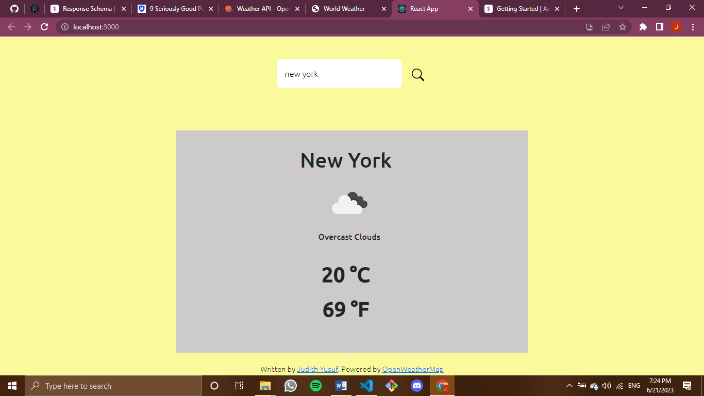

# T H E  W E A T H E R  A P P 
A react app for getting the weather of any city.
Live link - https://judithlk.github.io/the-weather-app/

## Screenshot

### APIs used:
Open Weather - Current Weather Data (https://openweathermap.org/current)

### API Information
- Method: `GET`
- URL: `https://api.openweathermap.org/data/2.5/weather?q=${city}&appid=${process.env.REACT_APP_OW_API_KEY}`

### Library used:
Axios (https://axios-http.com/docs/intro)

### Font used
Google Fonts - Ubuntu (https://fonts.googleapis.com/css2?family=Ubuntu:wght@300;500&display=swap) 

### Icons 
Bootstrap (npm i react-bootstrap-icons)

### Lastly...
Please leave a star and follow (I will follow back).

Thanks for stopping by :)
